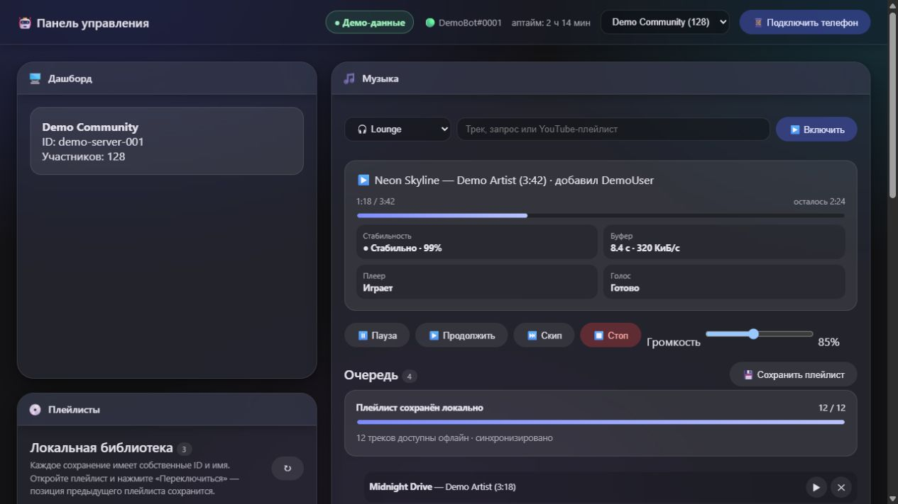
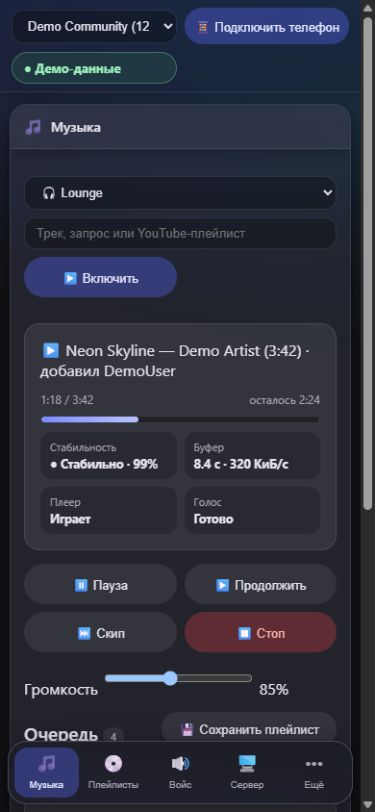

# 🤖 Discord Bot

Текущая версия: **1.14.0**. Подробное описание изменений — в
[CHANGELOG.md](CHANGELOG.md).

Discord-бот на discord.js/Bun: управление структурой сервера (роли, каналы, права),
музыка с YouTube и загруженных медиафайлов с кэшированием на диск, история сообщений, веб-панель управления.
Работает в Docker.

**Возможности:**
- 🎵 Музыка с YouTube (`yt-dlp` + `ffmpeg`), кэш скачанных треков на диске — повторное
  воспроизведение идёт с диска, а не по сети
- 📎 `/play file:` принимает аудио и видео, которые понимает FFmpeg; из видео
  воспроизводится звуковая дорожка
- 🖥️ Веб-панель (`http://127.0.0.1:8787`) — конфиг, музыка, голосовой дашборд
  (кто в канале + мьют/бан), участники, модерация, история, статистика
- 📱 Мобильный доступ через ngrok: QR-pairing, одноразовые токены,
  сессии устройств и их отзыв из панели
- ✉️ Email-приглашения на сутки через `/get-url`, Cloudflare OTP и постоянные
  аккаунты email/пароль, которые владелец выдаёт и отзывает из панели
- ⚙️ Декларативная структура сервера (`config/structure.json`) — роли, каналы,
  права, изоляция ролей ("тюрьма"), глобальные deny/allow-правила
- 🗒️ SQLite-хранение истории, очередей, плейлистов, сессий и статусов
- ♻️ Восстановление очереди и таймкода текущего трека после перезапуска
- 🐳 Docker Compose с health-check и лимитами ресурсов

## 👀 Предпросмотр интерфейса

На скриншотах используются только демонстрационные данные. Реальные серверы,
пользователи, каналы, треки, идентификаторы, токены и адреса не публикуются.

**[Открыть интерактивную демонстрацию реального UI](https://radik097.github.io/DiscordBot/)**

GitHub Pages публикует те же HTML/CSS/JS-файлы, что использует Docker-панель.
На публичном домене запросы к Discord API заменяются локальным демо-слоем:
действия меняют только состояние открытой страницы и сбрасываются после обновления.

### Веб-панель



### Мобильная версия

<p align="center">
  
</p>

---

## 🚀 Быстрый старт

```bash
cp .env.example .env
# впишите DISCORD_TOKEN, CLIENT_ID, (опционально) GUILD_ID
cp config/structure.example.json config/structure.json
# отредактируйте под свой сервер — роли/каналы/права

docker compose up -d --build
docker compose logs -f
```

Веб-панель: http://127.0.0.1:8787. Кнопка «Подключить телефон» создаёт
защищённый ngrok-туннель и новый одноразовый QR-токен для pairing.

Зарегистрировать слэш-команды в Discord:
```bash
docker compose exec discord-bot bun run src/deploy-commands.js
```

---

## ⚙️ Требования

- Docker (Docker Desktop на Windows/macOS, Docker Engine на Linux)
- Токен бота и Application ID из [Discord Developer Portal](https://discord.com/developers/applications)

---

## 🔧 Конфигурация

### `.env`
```bash
DISCORD_TOKEN=   # обязательно — Bot Token из Developer Portal
CLIENT_ID=       # обязательно — Application ID
GUILD_ID=        # опционально — для мгновенной регистрации команд на одном сервере
DEPLOYMENT_MODE=local             # local или server
REMOTE_ACCESS_PROVIDER=auto       # local -> ngrok, server -> cloudflare
COMPOSE_PROFILES=pot              # для VPS: server,pot
WEB_PORT=8787
WEB_BIND_ADDRESS=127.0.0.1
MUSIC_DEFAULT_VOLUME_PERCENT=100 # начальная host-side громкость, 0-200
MUSIC_FILE_MAX_BYTES=209715200   # максимальный Discord-файл для /play, 200 МБ
NGROK_AUTHTOKEN=                  # только для local-режима
NGROK_DOMAIN=                     # опциональный закреплённый ngrok hostname
PUBLIC_BASE_URL=                  # server: https://panel.example.com
CLOUDFLARE_TUNNEL_TOKEN=          # server: токен Cloudflare Tunnel
YTDLP_POT_PROVIDER_URL=http://bgutil-provider:4416   # опционально
```

### Режимы Docker

Локальный компьютер — панель доступна на loopback, а мобильный доступ по кнопке
запускает ngrok:

```env
DEPLOYMENT_MODE=local
REMOTE_ACCESS_PROVIDER=auto
COMPOSE_PROFILES=pot
NGROK_AUTHTOKEN=...
```

Постоянный VPS — ngrok не запускается, а отдельный контейнер `cloudflared`
подключает домен к панели:

```env
DEPLOYMENT_MODE=server
REMOTE_ACCESS_PROVIDER=auto
COMPOSE_PROFILES=server,pot
PUBLIC_BASE_URL=https://panel.example.com
CLOUDFLARE_TUNNEL_TOKEN=...

# Рекомендуется для VPS с 8 GB RAM
BOT_MEMORY_LIMIT=5g
BOT_MEMORY_RESERVATION=2g
BOT_CPU_LIMIT=3.0
```

В Cloudflare Tunnel публичный hostname должен направляться на внутренний адрес
`http://discord-bot:8787` только в standalone-режиме. Для `/get-url`, Cloudflare
OTP и постоянных email-аккаунтов используется защищённая схема через DockerHub
gateway: tunnel направляется на `http://gateway:4180`, а gateway проверяет
Cloudflare JWT и подписывает подтверждённую почту для DiscordBot. Порт панели на
публичном интерфейсе открывать не нужно.

Подробная пошаговая настройка named tunnel, published hostname, One-time PIN,
Access application, gateway и `.env`:
**[Cloudflare Zero Trust Tunnel](docs/cloudflare-zero-trust-tunnel.md)**.

### `config/structure.json`
Не коммитится в репозиторий (см. `.gitignore`) — это конфигурация конкретного
Discord-сервера. Шаблон лежит в `config/structure.example.json`, скопируйте его
и отредактируйте под себя:
- `roles` — роли с цветом/правами/hoist
- `categories`, `channels` — категории и каналы с оверрайтами прав
- `musicAllowedRoles` — кому доступны музыкальные команды
- `globalDenyRoles` / `alwaysAllRoles` — права, применяемые на все каналы сразу
- `isolationRoles` — роли-изоляторы (например, "тюрьма"): доступ только к whitelisted каналам
- `protectedChannels` — каналы, которые `/setup wipe` не тронет

### `config/rules.md`
Текст правил сервера, публикуется командой `/rules post`.

---

## 📋 Команды

### Docker
```bash
docker compose up -d --build               # собрать/запустить 1.14.0 вместе с внутренним Cobalt
docker compose --profile pot up -d --build # запустить вместе с PO Token Provider
docker compose --profile server --profile pot up -d --build # VPS + Cloudflare
docker compose down          # остановить и удалить контейнер
docker compose logs -f       # логи в реальном времени
docker compose restart       # перезапуск
docker compose --profile pot build --no-cache discord-bot # полная пересборка
```

### Discord (слэш-команды)
```
/play query:<название, YouTube или ссылка сервиса Cobalt>
/play playlist:<ссылка на YouTube-плейлист>
/play file:<аудио/видео>
/skip    /pause    /resume    /stop
/queue                        /nowplaying         /volume <0-200>
/phone                        одноразовая ссылка для входа с телефона (только роль Ботоводство)
/get-url email:<почта>        одноразовая ссылка на сутки (только роль Ботоводство)
/anime genre:<жанр> min_year:<год>  случайное аниме по фильтрам
/download url:<публичная ссылка>    скачать медиа через внутренний Cobalt
/setup build                  создать структуру сервера из конфига
/setup export                 выгрузить текущую структуру сервера в конфиг
/setup validate                офлайн-проверка конфига
/setup wipe                   удалить всё, кроме protectedChannels
/rules post                    опубликовать правила
```

`/phone` работает только на Discord-сервере и только для участника с ролью
`Ботоводство` (регистр роли не важен). Ссылка отправляется ephemeral-ответом, живёт
пять минут и удаляется после первого успешного подтверждения на телефоне.
Администратор без роли `Ботоводство` получить ссылку не может.

`/get-url` также требует роль `Ботоводство` и отвечает только автору команды.
Получатель проходит email OTP на точном адресе из команды. Ссылка одноразовая,
а созданная сессия живёт 24 часа. Постоянные аккаунты создаются владельцем через
раздел «Доступ» веб-панели и после активации используют email и пароль.

`/anime` выбирает одну случайную не-18+ запись указанного жанра, выпущенную не
раньше `min_year`. Данные берутся через публичный GraphQL API AniList. Результат
содержит название, описание, обложку, год, формат, эпизоды, оценку, карточку
AniList и ссылку поиска этого названия на AniDB. Запросы ограничены по частоте,
а выборки по сочетанию жанра и года кэшируются на 15 минут.

`/download` доступна администратору и ролям из `downloadAllowedRoles` (по
умолчанию `Ботоводство`). Бот принимает только публичные HTTP(S)-ссылки без
учётных данных, передаёт их собственному Cobalt-контейнеру и не обходит DRM,
paywall или доступ к приватным материалам. Маленький файл отправляется приватным
вложением Discord с учётом фактического `attachment_size_limit`; крупный получает
случайную временную ссылку панели. Полный URL с query-параметрами в истории не
хранится. По умолчанию действуют лимит 500 МБ, две одновременные загрузки,
очередь 20 и cooldown 30 секунд. Раздел «Загрузки» показывает настройки, очередь
и последние операции. Cobalt не публикует порт хоста и доступен только боту в
Docker-сети.

`/play` принимает ровно один источник: `query` для одного трека, `playlist`
для ссылки на YouTube-плейлист либо `file` с вложением Discord. Ссылка на видео
с параметром `list` в режиме `query` воспроизводит только выбранное видео;
ссылка только на плейлист должна передаваться через `playlist`. Файл потоково сохраняется в аудиокэш,
проверяется через `ffprobe`, а FFmpeg извлекает и воспроизводит его аудиодорожку.
Поддерживаются аудио- и видеоконтейнеры, которые распознаёт установленный FFmpeg;
видеоряд в голосовой канал не передаётся. По умолчанию размер ограничен 200 МБ
через `MUSIC_FILE_MAX_BYTES`. `playlist` добавляет до 500 доступных роликов в
очередь по порядку.
HTTP(S)-ссылка не с YouTube передаётся внутреннему Cobalt в режиме `audio`.
Полученный файл потоково ограничивается, проверяется через `ffprobe`, сохраняется
в общем аудиокэше и воспроизводится обычным FFmpeg-пайплайном. Это позволяет
проигрывать одиночные публичные медиа из поддерживаемых Cobalt сервисов без
изменения поведения YouTube и текстового поиска. Альбомы и плейлисты сторонних
сервисов не разворачиваются; `picker` выбирает общую аудиодорожку либо первый
подходящий видеоэлемент. DRM, paywall и приватный контент не обходятся. Лимит
одного трека — 200 МБ через `COBALT_MUSIC_MAX_BYTES`.
Динамические YouTube Mix (`list=RD...`) сохраняют исходный `v=...` либо
восстанавливают seed-видео из ID, после чего также разбиваются на треки.
Веб-панель обновляет музыкальный прогресс каждую секунду и показывает
прошедшее/оставшееся время, буфер, состояния плеера и voice-соединения,
а также стабильность воспроизведения по последним 30 секундным замерам.
У каждого ожидающего трека есть кнопки немедленного включения и удаления из
очереди. Кнопка «Сохранить плейлист» создаёт манифест в
`data/playlists/<guild-id>/` и в фоне загружает текущий трек вместе с очередью в
`data/cache/audio/`, не прерывая воспроизведение. Одновременно выполняются не
более двух загрузок; уже закэшированные композиции повторно не скачиваются.
Перед сохранением панель предлагает выбрать существующее имя или ввести новое.
Повторное имя создаёт новую версию без удаления старого манифеста, а отдельная
панель «Плейлисты» показывает локальную библиотеку свёрнутым списком и лениво
подгружает треки при раскрытии.
При штатном или аварийном перезапуске сохраняются текущий трек, очередь,
громкость и голосовой канал. После восстановления Discord-сессии бот
переподключается и продолжает трек с сохранённого таймкода.

---

## 📁 Структура проекта

```
discord-bot/
├── src/
│   ├── index.js              # точка входа, обработчики событий
│   ├── commandLoader.js
│   ├── db.js                 # SQLite: история сообщений, статистика
│   ├── structureManager.js   # применение config/structure.json к серверу
│   ├── commands/              # слэш-команды (music, rules, setup)
│   ├── music/
│   │   ├── queue.js           # очередь, воспроизведение, статистика буфера
│   │   ├── source.js          # yt-dlp + ffmpeg + кэш на диске
│   │   └── persistence.js     # сохранение/восстановление очереди
│   └── web/
│       ├── server.js          # REST API (Bun.serve)
│       └── public/            # веб-панель (HTML/CSS/JS)
├── config/
│   ├── structure.example.json # шаблон — коммитится
│   ├── structure.json         # реальный конфиг сервера — НЕ коммитится
│   └── rules.md
├── data/                       # SQLite, кэш аудио, лог — НЕ коммитится
├── scripts/                    # init-скрипты, systemd unit
├── Dockerfile
└── docker-compose.yml
```

---

## 🐛 Диагностика

**Бот не стартует** — `docker compose logs`, проверить `DISCORD_TOKEN`/`CLIENT_ID` в `.env`.

**Музыка не играет** — `docker compose logs | grep -iE "yt-dlp|ffmpeg|cache"`. Частые причины:
отсутствие интернета у контейнера, устаревший кэш (можно почистить `data/cache/audio/`).

**Веб-панель не открывается** — проверить `docker compose ps` (контейнер должен быть `Up`),
`curl http://127.0.0.1:8787/health`.

**Порт 8787 занят** — сменить `WEB_PORT` в `.env`, `docker compose up -d`.

---

## 🔒 Безопасность

- Веб-панель слушает `0.0.0.0` внутри контейнера, но наружу пробрасывается только
  на `127.0.0.1` хоста (см. `docker-compose.yml`).
- В режиме `server` внешний HTTPS предоставляет Cloudflare Tunnel; контейнер
  `cloudflared` не требует входящих портов. Ngrok используется только в режиме
  `local` и только после нажатия кнопки подключения телефона.
- Разовые ссылки привязаны к email, хранятся только в виде SHA-256-хэша и
  погашаются при первом успешном входе; пароли постоянных аккаунтов защищены
  `scrypt` с индивидуальной солью.
- Сессии можно просматривать и отзывать в панели; изменяющие запросы защищены
  проверками прав, CSRF-токенами, rate limiting и приоритетом владельца.
- `.env` и `config/structure.json` не коммитятся — в первом токены, во втором
  конфигурация конкретного вашего сервера.
- `data/` (история сообщений, кэш аудио, логи) не коммитится.

---

## 📝 Лицензия

Проект предоставляется как есть, для управления собственным Discord-сервером.
